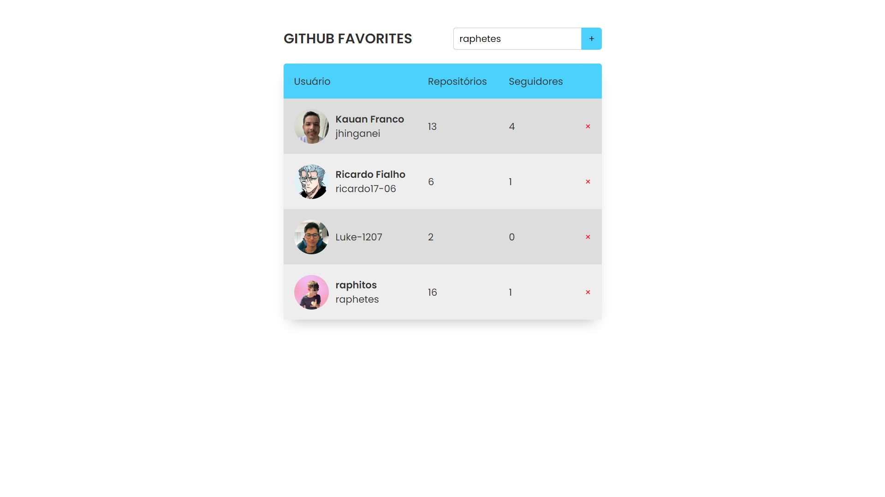

<h1 align="center"> Github Favorites </h1>

Projeto feito para aprender mais conceitos JS e usar uma API do GitHub 

  <a href="#-tecnologias">Tecnologias</a>&nbsp;&nbsp;&nbsp;|&nbsp;&nbsp;&nbsp;
  <a href="#-projeto">Projeto</a>&nbsp;&nbsp;&nbsp;|&nbsp;&nbsp;&nbsp;

 

  

## 🚀 Tecnologias

Esse projeto foi desenvolvido com as seguintes tecnologias:

- HTML e CSS
- JavaScript
- Git e Github

## 💻 Projeto

Uma lista para pesquisar usuários do Github.

- [Visite meu projeto online](https://raphetes.github.io/github-favorites)

---
